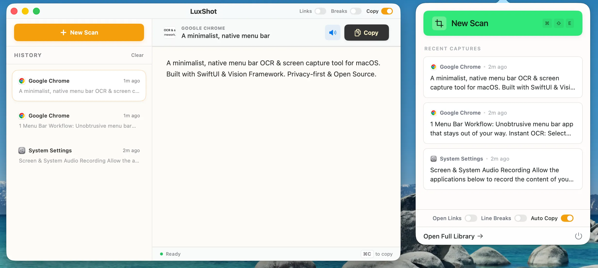

  

  <h1>LuxShot</h1>

  

    <strong>A minimalist, native menu bar OCR & screen capture tool for macOS.</strong>
     
    Built with SwiftUI & Vision Framework. Privacy-first & Open Source.
  

  

    
    
    
  

   

  

 

## Features

- 🖥️ **Menu Bar Workflow**: Unobtrusive menu bar app that stays out of your way.
- ⚡ **Instant OCR**: Select any screen region to instantly recognize text using Apple's Vision framework.
- 📸 **QR & Barcode Scanning**: Automatically detects and decodes QR codes and barcodes.
- ✨ **Smart Formatting**: 
  - **Keep/Remove Line Breaks**: Toggle to preserve original formatting or flow text into a single paragraph.
  - **Auto-Open Links**: Detects URLs in captured text and opens them in your browser.
  - **Auto-Copy**: Automatically copies recognized text to clipboard.
- 🔊 **Text-to-Speech (TTS)**: Read recognized text aloud with a single click.
- 📜 **History Management**: Keeps a history of recent scans for easy access.
- 🔒 **Privacy First**: All processing happens on-device. No data is sent to the cloud.

## 🚀 Installation for Users

Since LuxShot is an open-source project and not distributed via the App Store, you might encounter a security warning when opening it for the first time. This is normal for apps not notarized by Apple.

1. Go to the [Releases](../../releases) page and download the latest `.zip` file.
2. Drag `LuxShot.app` to your **Applications** folder.
3. **Right-click (or Control-click)** on `LuxShot.app` and select **Open**.
4. You will see a dialog saying "LuxShot cannot be opened because the developer cannot be verified". 
5. Click **Open** (or "Open Anyway").
   - *Note: If you don't see the "Open" option, go to System Settings > Privacy & Security > Scroll down to Security section > Click "Open Anyway" for LuxShot.*

Once you do this once, macOS will remember your choice and you can open the app normally in the future.

## 🛠️ Usage

1. **Launch LuxShot**: The app runs in your menu bar (look for the [ ] icon).
2. **Capture**: 
   - Press **`Cmd + Shift + E`** (Global Shortcut)
   - Or click "New Scan" in the menu bar popover.
3. **Select**: Drag to select a region on your screen.
4. **Done**: Text is instantly recognized and copied to your clipboard (if Auto-Copy is on).

## 🏗️ Technology Stack

- **Language**: Swift 5.9
- **UI Framework**: SwiftUI + AppKit (NSPopover, NSStatusItem)
- **OCR Engine**: Vision Framework (`VNRecognizeTextRequest`)
- **Barcode Detection**: Vision Framework (`VNDetectBarcodesRequest`)
- **Audio**: AVFoundation (`AVSpeechSynthesizer`)

## 🔨 Building from Source

1. Clone the repository.
2. Open `LuxShot.xcodeproj` in Xcode.
3. Ensure the Signing Team is set to your developer account (or None for local testing).
4. Build and Run (Command + R).

## 📋 Requirements

- macOS 13.0 (Ventura) or later.

## 📜 License

This project is licensed under the GNU General Public License v3.0 - see the [LICENSE](LICENSE) file for details.

## 🤝 Contributing

Pull requests are welcome. For major changes, please open an issue first to discuss what you would like to change.

---
Maintained by [@lukebuild](https://github.com/lukebuild)
